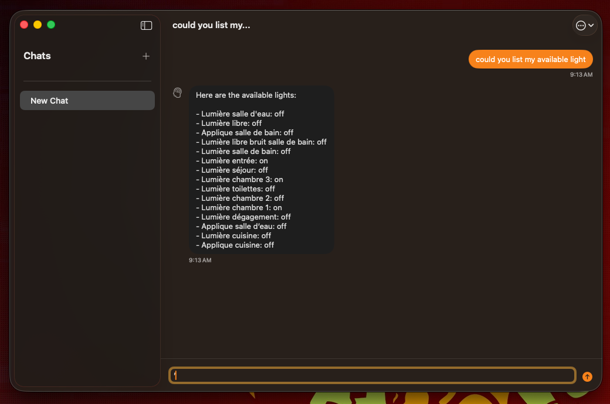

# PrivateChat

A macOS Application to chat with Apple Foundation Models.

## Features

- 🤖 **Interactive Chat Mode**: Real-time conversations with Foundation Models
- 🔧 **MCP Integration**: Automatic loading of tools from Claude Desktop configuration and vs code one.

## Installation

### Prerequisites

- macOS 26.0 or later
- Swift 6.2 or later
- Xcode 26.0 or later (for development)

## TODO

- persist chat session
- settings for MCP: filter them or add some
- fix bugs
 - kill mcp servers, do not spawn many of them